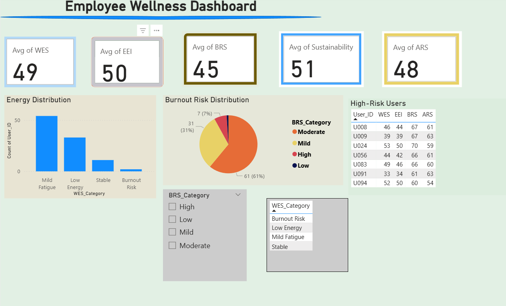
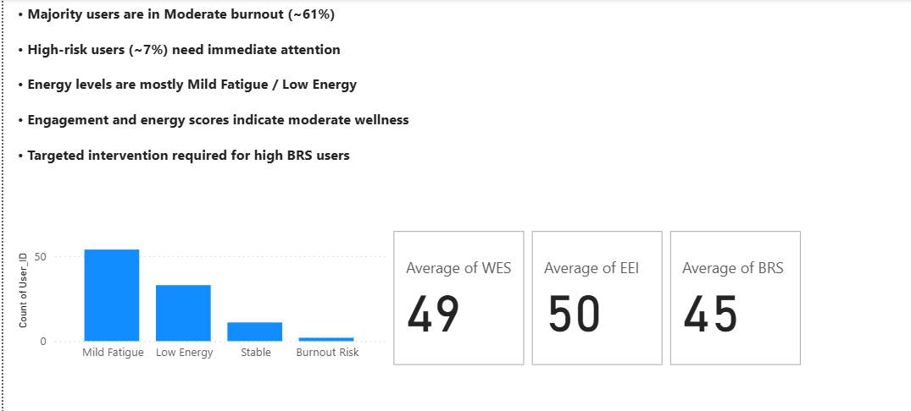

# Employee Wellness Dashboard (Power BI)
🚀 A data-driven Power BI project to analyze employee wellness, identify burnout risks, and support strategic HR decision-making.
## 📊 Overview
This project analyzes employee wellness using Power BI, focusing on burnout risk, energy levels, engagement, and sustainability. The dashboard provides interactive insights to support data-driven decision-making for HR and management.

---

## 🎯 Objective
- Identify high-risk employees (burnout)
- Analyze energy and engagement levels
- Provide actionable insights for improving employee wellness

---

## 📊 Dashboard Preview

---

## 📈 Insights View

---

## 🔍 Key Insights
- ~61% users fall under **Moderate burnout**
- ~7% users are **High-risk** and need immediate attention
- Majority users show **Mild Fatigue / Low Energy**
- Overall wellness levels are **moderate**

---

## 🔮 Prediction
Moderate burnout users may transition to **high-risk** if no intervention is implemented.

---

## 🛠 Tools Used
- Power BI  
- Excel  

---

## 📂 Files Included
- Power BI Dashboard (`.pbix`)
- Dataset (`.xlsx`)
- Report (`.pdf`)
- Dashboard Screenshots

---

## 💡 Recommendations
- Provide targeted support for high-risk employees  
- Improve engagement through wellness programs  
- Focus on boosting energy levels  
- Monitor KPIs regularly for early intervention  

---

## 🚀 Conclusion
This dashboard enables organizations to monitor employee wellness effectively and take proactive steps to reduce burnout and improve overall productivity.

---

## 📌 Project Highlights
- Interactive Power BI dashboard  
- Real-world business insights  
- Data-driven recommendations  
- GitHub portfolio project  

